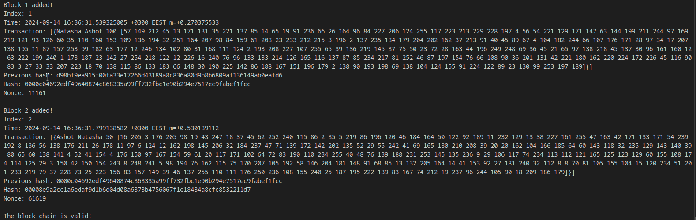

# blockchain-go
Simple blockchain on golang

# HOW IT WORKS

-**Key generation:** Uses Go's built-in cryptographic library to generate RSA keys, which are used to sign transactions.

-**Creating transactions:** The example creates two transactions: the first between Natasha and Ashot, and the second from Ashot to Natasha.

-**Mining blocks:** Each block contains a list of transactions, and requires mining (Proof-of-Work) to add it to the blockchain.

-**Checking the integrity of the chain:** The program checks that the blockchain is not corrupted and that all blocks are valid.

-**Printing blocks:** Once created, the blocks are printed to the screen with information about the transactions, hash, and other parameters.

# DESCRIPTION

-**Transactions** - Transactions are created and signed using the sender's private key.

-**Blocks** - Blocks contain a list of transactions and a hash of the previous block. They are mined using the Proof-of-Work algorithm.

-**Blockchain** - The structure of the blockchain contains an array of blocks and a method for checking the integrity of the chain.

-**Integrity** - The blockchain checks the integrity of each block and the entire chain before adding new blocks.

**Run with the command:**

`go run main.go`

# RESULTS

